# Game-Dev-TC-modul-3
Modul 3 Komunitas Game Dev TC 2020

## Tujuan
1. Peserta memahami basics 2D unity
2. Peserta dapat menggambarkan object dengan ```sprite renderer```
3. Peserta dapat menggunakan physics engine dalam unity
4. Peserta dapat membuat kontrol platformer sederhana

## Sprite Renderer dan Sprite
https://docs.unity3d.com/Manual/Sprites.html
https://docs.unity3d.com/Manual/class-SpriteRenderer.html

## Collider2D
https://docs.unity3d.com/Manual/Collider2D.html

## Rigidbody2D
https://docs.unity3d.com/Manual/class-Rigidbody2D.html

## Membuat platform Game

1. Download folder sprites dalam github ini.
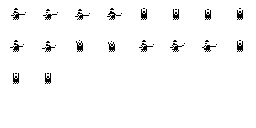
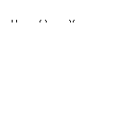


Sprite - sprite tersebut akan menjadi asset graphic dalam game ini.

2. Setelah mendownload folder sprite, silahkan membuat project dengan setting 2D dan ubah nama project menjadi nama game (disini akan dinamai "platformer game").

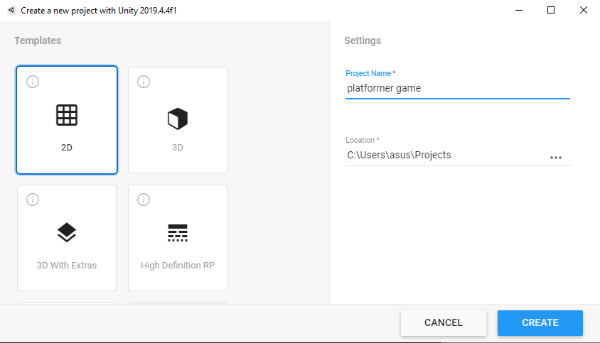

3. Masukkan folder sprite tersebut dalam projectnya, untuk mendapatkan direktory project dengan mudah. Dapat klik kanan dalam tab project lalu pilih Show in explorer.

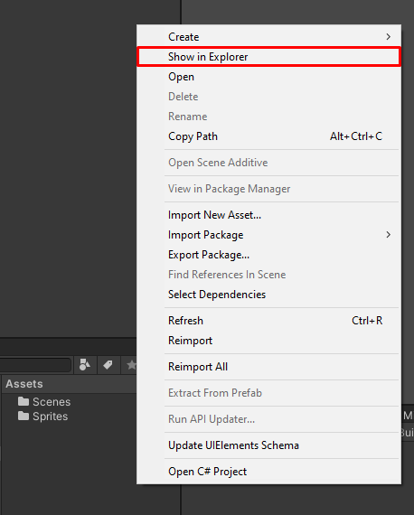

4. Karena game kita adalah game, pixel art, maka kita perlu setting gambarnya agar tidak ada anti-aliasing. Lalu karena semua gambar tersebut adalah sprite-sheet, maka kita harus memisahkannya menjadi individual sprite.
Klik gambar pada folder, maka inspector akan menunjukkan informasi berikut.

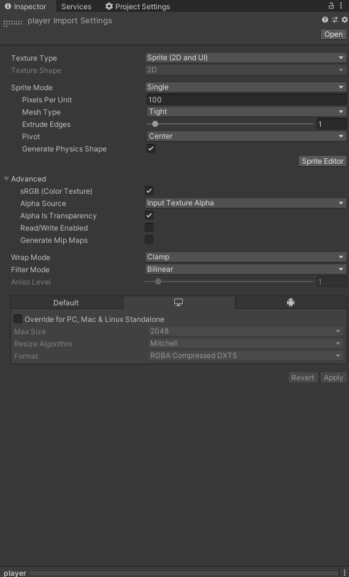

Ubah sprite mode menjadi multiple, dan pixel per unit menjadi 32. filter mode menjadi point, dan ubah format compression menjadi rgba32.

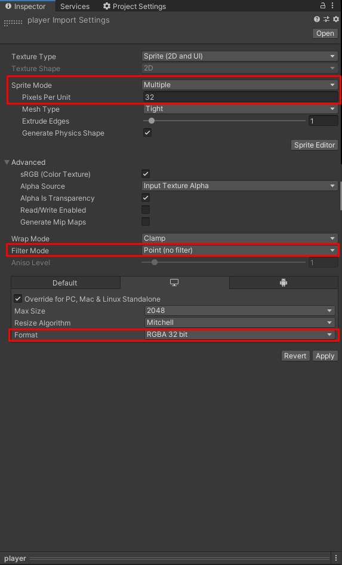

Setelah itu klik apply.

5. Tekan sprite editor dalam inspector untuk memotong sprite tersebut. Maka akan keluar window seperti berikut

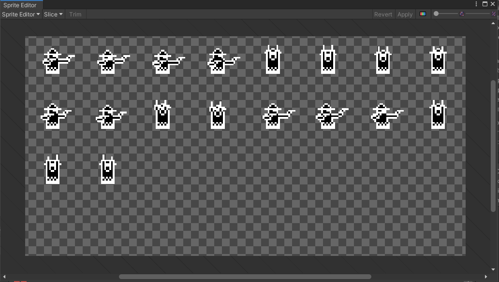

Setelah itu, tekan slice dan ubah type ke ```Grid By Cell Size``` dan ubah x dan y menjadi 32. Lalu tekan slice.

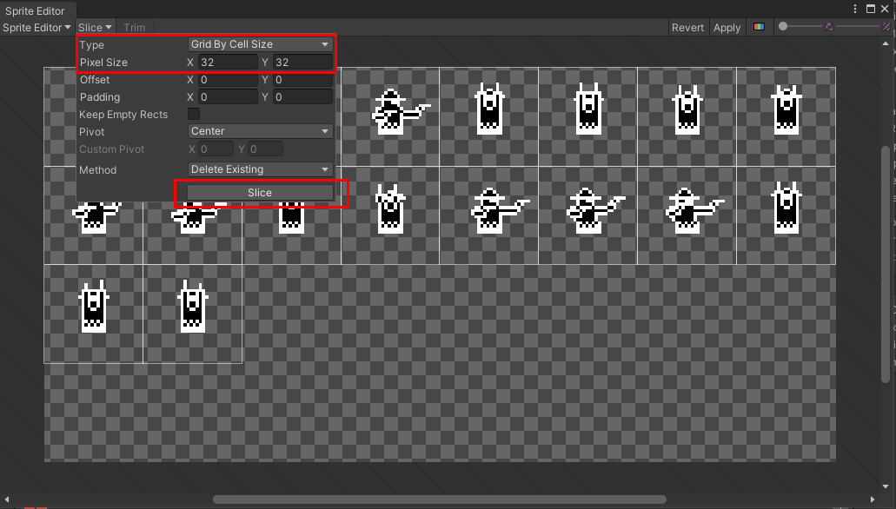

6. Lakukan hal tersebut pada sprite yang lainnya.

7. Buat empty game object dan beri nama Player. Lalu buat 1 empty game object sebagai child object player dan beri nama "Graphic". Lalu buat 2 empty game object sebagai child object Graphic dan beri nama masing-masing "upper body" dan "lower body".

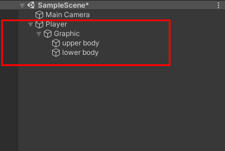

8. Beri Sprite Renderer pada upper body dan lower body. Pada upper body, beri sprite ```player_0``` sedangkan pada lower body, beri sprite ```player_leg_0```.

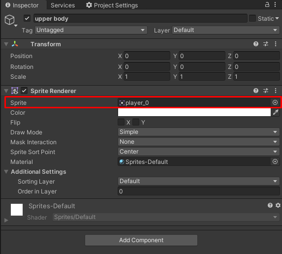

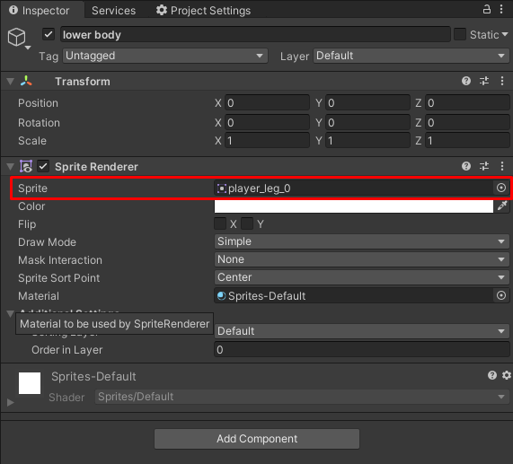

Dalam scene akan terlihat seperti ini

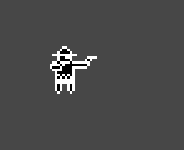

9. Dalam object Player tambahkan 2 component, yaitu Rigidbody2D dan BoxCollider2D.

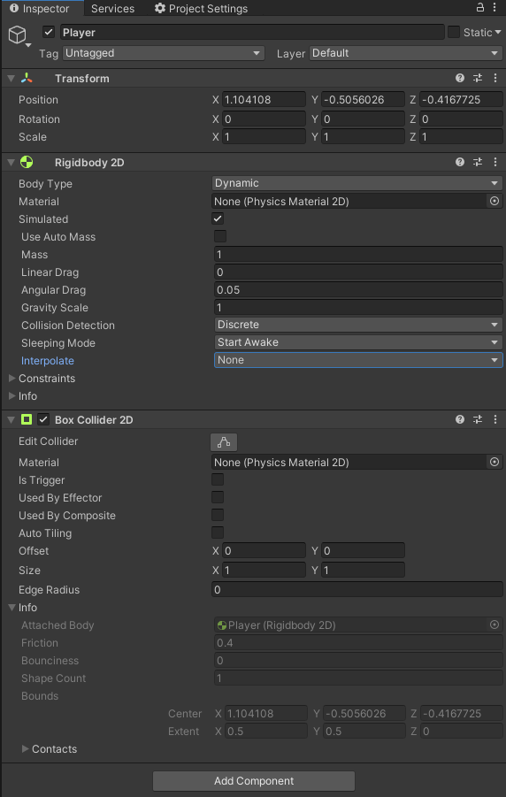

10. Edit box collider dengan menekan tombol ```edit collider``` pada inspector.

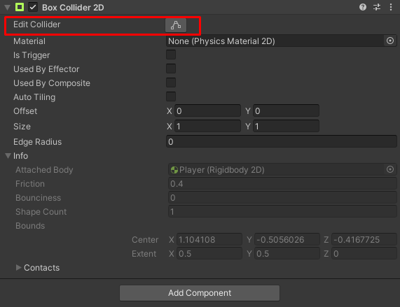

Lalu adjust box dalam player agar sesuai dengan graphic player.

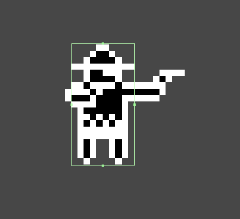

11. Untuk ground, sementara kita dapat menggunakan sprite box. Kita akan belajar tile map di pelajaran selanjutnya. Unity menyediakan primitive sprite. Primitive sprite yang disediakan unity ada 6, yaitu Square, Triangle, Diamon, Hexagon, Circle, dan Polygon.

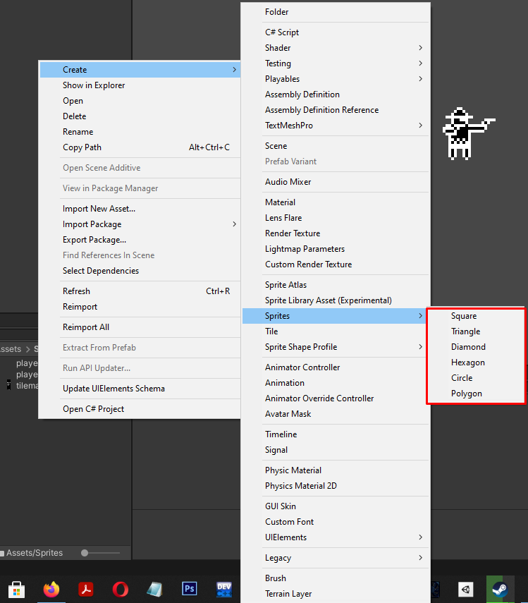

Buatlah sprite square, dan beri nama "Square".

12. Salah satu cara untuk membuat game object dengan sprite renderer, adalah dengan langsung men-drag and drop sprite ke scene view. Drag and drop sprite square langsung ke scene view, maka akan terbuat game object bernama square dengan gambar square.

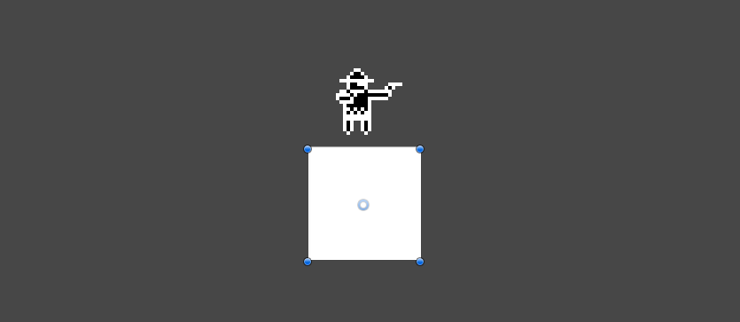

13. Ini akan menjadi ground sementara kita. Adjust besar ground tersebut agar pemain bisa bergerak bebas. Lalu tambahkan BoxCollider2D agar pemain kita tidak tembus ke tanah.

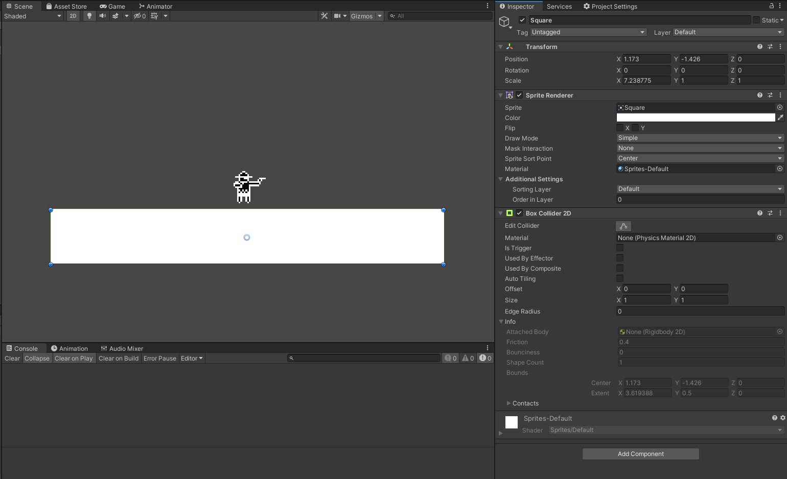

14. Sekarang gamenya sudah bisa kita play, dan player akan collide dengan ground. Selanjutnya, kita akan buat agar player bisa bergerak dengan input keyboard.