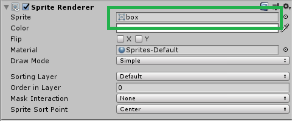

# Game-Dev-TC-modul-3
Modul 3 Komunitas Game Dev TC 2020

## Tujuan
1. Peserta memahami basics 2D unity
2. Peserta dapat menggambarkan object dengan ```sprite renderer```
3. Peserta dapat menggunakan physics engine dalam unity
4. Peserta dapat membuat kontrol platformer sederhana

## Sprite Renderer dan Sprite
```Sprite``` adalah gambar yang digunakan sebagai visual sebuah game. ```SpriteRenderer``` adalah cara unity menggambarkan ```sprite``` tersebut ke dalam game. Dengan ```sprite``` renderer kita dapat dengan mudah menggambar, gambar dalam game. ```SpriteRenderer``` digunakan untuk object yang ada di game world, bukan ui game.


Pada component ```SpriteRenderer```, kita dapat merubah bagaimana unity men-*render* ```sprite``` tersebut. Untuk sementara, kita hanya peduli dengan apa yang digambar oleh SpriteRenderer. Untuk menggambar sebuah ```sprite```, kita dapat men-*drag and drop* ```sprite``` gambar yang kita ingin gambar ke dalam kolom ```sprite```.



## Collider2D
Dalam game, terkadang kita membutuhkan beberapa object untuk bertabrakan dengan object lainnya. Untuk deteksi tersebut, kita membutuhkan collider. ```Collider``` dalam unity ada 2, yaitu ```Collider3D``` dan ```Collider2D```. ```Collider3D``` tidak dapat berinteraksi dengan ```Collider2D```, dan begitu juga sebaliknya. Untuk game 2D kita akan menggunakan ```Collider2D```.

```Collider2D``` dalam unity ada beberapa macam :
1. ```CircleCollider2D```
2. ```BoxCollider2D```
3. ```PolygonCollider2D```
4. ```EdgeCollider2D```
5. ```CapsuleCollider2D```
6. ```CompositeCollider2D```

Collider - collider yang tersebut tentu mempunyai bentuk yang berbeda. Gunakan sesuai bentuk sprite.

**Note : Polygon Collider, Edge Collider dan Composite Collider membutuhkan processing power lebih besar daripada primitive shaped collider**

## Rigidbody2D
Rigidbody2D adalah cara agar game object dapat dikontrol oleh physiscs engine unity.
