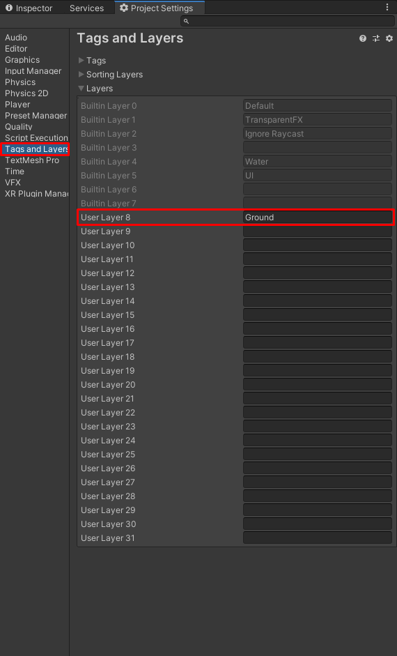

# Game-Dev-TC-modul-3
Modul 3 Komunitas Game Dev TC 2020

## Tujuan
1. Peserta memahami basics 2D unity
2. Peserta dapat menggambarkan object dengan ```sprite renderer```
3. Peserta dapat menggunakan physics engine dalam unity
4. Peserta dapat membuat kontrol platformer sederhana

## Membuat platform Game

### Meng-import sprites

1. Download folder sprites dalam github ini.


Sprite - sprite tersebut akan menjadi asset graphic dalam game ini.

2. Setelah mendownload folder sprite, silahkan membuat project dengan setting 2D dan ubah nama project menjadi nama game (disini akan dinamai "platformer game").


3. Masukkan folder sprite tersebut dalam projectnya, untuk mendapatkan direktory project dengan mudah. Dapat klik kanan dalam tab project lalu pilih Show in explorer.


4. Karena game kita adalah game, pixel art, maka kita perlu setting gambarnya agar tidak ada anti-aliasing. Lalu karena semua gambar tersebut adalah sprite-sheet, maka kita harus memisahkannya menjadi individual sprite.
Klik gambar pada folder, maka inspector akan menunjukkan informasi berikut.


Ubah sprite mode menjadi multiple, dan pixel per unit menjadi 32. filter mode menjadi point, dan ubah format compression menjadi rgba32.


Setelah itu klik apply.

5. Tekan sprite editor dalam inspector untuk memotong sprite tersebut. Maka akan keluar window seperti berikut


Setelah itu, tekan slice dan ubah type ke ```Grid By Cell Size``` dan ubah x dan y menjadi 32. Lalu tekan slice.


6. Lakukan hal tersebut pada sprite yang lainnya.

### Menggunakan Rigidbody2D dan Collider2D

1. Buat empty game object dan beri nama Player. Lalu buat 1 empty game object sebagai child object player dan beri nama "Graphic". Lalu buat 2 empty game object sebagai child object Graphic dan beri nama masing-masing "upper body" dan "lower body".


2. Beri Sprite Renderer pada upper body dan lower body. Pada upper body, beri sprite ```player_0``` sedangkan pada lower body, beri sprite ```player_leg_0```.

Attribut sprite adalah apa yang akan ditampilkan oleh sprite renderer. Dalam sprite renderer terdapat attribut lainnya seperti color. Color berfungsi untuk memberikan efek tint pada sprite.


Dalam scene akan terlihat seperti ini


3. Dalam object Player tambahkan 2 component, yaitu Rigidbody2D dan BoxCollider2D.

Rigidbody2D digunakan untuk membuat object tersebut disimulasikan dalam physics engine unity. Dalam attributnya kita bisa memberikan body type.
Body type dalam Physics engine 2D ada 3, yaitu static, kinematic, dan dynamic.
- static berarti object akan dianggap sebagai benda yang tidak bergerak sama sekali.
- kinematic berarti object tersebut tidak akan digerakkan oleh physics engine unity, namun bisa digerakkan melalui script.
- dynamic berarti object akan digerakkan secara penuh oleh physics engine unity. Meskipun begitu, kita tetap dapat mengatur properti seperti kecepatan ataupun langsung mengubah posisi tersebut.

BoxCollider2D adalah salah satu collider primitive yang disediakan oleh unity. Collider adalah cara game mendeteksi pertabrakan benda. BoxCollider2D menandakan bahwa area dalam box itu adalah solid ke Rigidbody2D. Unity mempunyai collider lainnya, seperti :
- BoxCollider2D
- CircleCollider2D
- PolygonCollider2D
- CompositeCollider2D
- CapsuleCollider2D
- CircleCollider2D
- TilemapCollider2D


4. Edit box collider dengan menekan tombol ```edit collider``` pada inspector.


Lalu adjust box dalam player agar sesuai dengan graphic player.


5. Untuk ground, sementara kita dapat menggunakan sprite box. Kita akan belajar tile map di pelajaran selanjutnya. Unity menyediakan primitive sprite. Primitive sprite yang disediakan unity ada 6, yaitu Square, Triangle, Diamon, Hexagon, Circle, dan Polygon.


Buatlah sprite square, dan beri nama "Square".

6. Salah satu cara untuk membuat game object dengan sprite renderer, adalah dengan langsung men-drag and drop sprite ke scene view. Drag and drop sprite square langsung ke scene view, maka akan terbuat game object bernama square dengan gambar square.


7. Ini akan menjadi ground sementara kita. Adjust besar ground tersebut agar pemain bisa bergerak bebas. Lalu tambahkan BoxCollider2D agar pemain kita tidak tembus ke tanah.


8. Sekarang gamenya sudah bisa kita play, dan player akan collide dengan ground.

### Membuat kontrol platformer

1. Selanjutnya, kita akan buat agar player bisa bergerak dengan input keyboard. Buatlah script bernama, PlayerMovement.cs dan isi dengan kode berikut.

```
using System.Collections;
using System.Collections.Generic;
using UnityEngine;

public class PlayerMovement : MonoBehaviour {

    private Rigidbody2D rb2d;
    private float dir;
    [SerializeField] private float speed = 5;

    void Start(){
        rb2d = GetComponent<Rigidbody2D>();
    }

    void Update(){
        float horizontalInput = Input.GetAxis("Horizontal");
        dir = horizontalInput;
    }

    private void FixedUpdate(){
        rb2d.velocity = new Vector2(dir * speed, rb2d.velocity.y);
    }

}
```

Dalam script tersebut kita membuat 3 variabel. Pertama adalah variabel rb2d yang digunakan untuk menyimpan component Rigidbody. Variabel kedua adalah dir yaitu arah player bergerak sekarang. Yang terakhir adalah kecepatan player. Disini adalah kecepatan player bergerak.

Method Start akan dijalankan pertama kali, dalam method start kita akan mengambil component Rigidbody2D dalam object Player (Karena script PlayerMovement.cs terpasang di object Player).

Method Update akan dijalankan setiap frame dalam game. Ini bagus untuk melakukan input handling. Melakukan perubahan object dengan method update sangat tidak dianjurkan, karena fungsi update tidak akan menentu terpanggil kapan. Disini kita menggunakannya untuk menyimpan arah gerak player menggunakan Input.GetAxis;

Method FixedUpdate akan dijalankan secara konstan. Yang dapat disetting di Project Settings (secara default setiap 0.2s). Method fixed update sangatlah tepat untuk melakukan perubahan yang berhubungan dengan simulasi physics. Seperti pergerakan atau perubahan velocity. Disini kita menggunakan variabel dir tadi untuk melakukan perubahan kecepatan player.

2. Masukkan script PlayerMovement.cs ke dalam object Player. Dengan Add Component > PlayerMovement


Sekarang kalau kita play. Player sudah bisa bergerak kekiri dan kekanan.

3. Selanjutnya kita akan buat player bisa lompat.

Dalam script PlayerMovement.cs tambahkan kode berikut

```
using System.Collections;
using System.Collections.Generic;
using UnityEngine;

public class PlayerMovement : MonoBehaviour {

    private Rigidbody2D rb2d;
    private float dir;
    [SerializeField] private float speed = 5;
    [SerializeField] private float jumpForce = 10;//berubah

    void Start(){
        rb2d = GetComponent<Rigidbody2D>();
    }

    void Update(){
        float horizontalInput = Input.GetAxis("Horizontal");
        dir = horizontalInput;
        if(Input.GetButtonDown("Jump")){ //berubah
            Jump(); //berubah
        }//berubah
    }

    private void FixedUpdate(){
        rb2d.velocity = new Vector2(dir * speed, rb2d.velocity.y);
    }

    private void Jump(){//berubah
        rb2d.velocity = new Vector2(rb2d.velocity, jumpForce);//berubah
    }//berubah

}
```

Terdapat 1 variabel baru, yaitu jumpForce. Ini merupakan kecepatan awal player saat lompat.

Terdapat juga 1 method baru, yaitu Jump. Method Jump melakukan perilaku jump pada player.

Perubahan yang terakhir adalah dalam fungsi Update kita menambahkan permisalan jika tombol jump ditekan maka method Jump akan dipanggil. Dengan ini Jump akan terpanggil saat player menekan tombol jump.

4. Akan tetapi jika kita menekan spasi di udara, player akan terus melompat tanpa harus menyentuh tanah. Kita akan menyelesaikan ini dengan menggunakan teknik bernama raycast.

Sebelum kita merubah script, kita harus menambahkan layer ground pada projectnya. Untuk itu kita harus membuka project settings.



Lalu assign object square ke layer ground.


Ubah script PlayerMovement.cs menjadi

```
using System.Collections;
using System.Collections.Generic;
using UnityEngine;

public class PlayerMovement : MonoBehaviour {

	private Rigidbody2D rb2d;
	private float dir;
	[SerializeField] private float speed = 5;
	[SerializeField] private float jumpForce = 10;
	[SerializeField] private LayerMask groundMask;//berubah
	private bool isTouchingGround = false;//berubah

	void Start() {
		rb2d = GetComponent<Rigidbody2D>();
	}

	void Update() {
		float horizontalInput = Input.GetAxis("Horizontal");
		dir = horizontalInput;
		if (Input.GetButtonDown("Jump") && isTouchingGround) {//berubah
			Jump();
		}
	}

	private void FixedUpdate() {
		rb2d.velocity = new Vector2(dir * speed, rb2d.velocity.y);
		isTouchingGround = Physics2D.Raycast(transform.position, Vector2.down, 1f, groundMask);//berubah
	}

	private void Jump() {
		rb2d.velocity = new Vector2(rb2d.velocity.x, jumpForce);
	}

}
```

Disini kita membutuhkan variabel boolean yang menandakan player sedang menyentuh tanah. Lalu selanjutnya kita membutuh layer mask untuk layer ground.

Dalam permisalan saat method Jump dipanggil ditambahkan kondisi isTouchingGround. Variabel ini akan diisi saat di method FixedUpdate.

Dalam FixedUpdate, kita akan melakukan raycast kebawah untuk mengecek ground. Raycast akan melakukan cast ray dan mengembalikan nilai true jika cast mengenai sesuatu dan bernilai false jika tidak mengenai sesuatu.

Assign layer Ground ke properti PlayerMovement.cs di object Player.


Dengan ini player dapat bergerak kanan kiri dan bisa lompat saat berada diatas ground.

## References

https://docs.unity3d.com/Manual/Sprites.html
https://docs.unity3d.com/Manual/class-SpriteRenderer.html
https://docs.unity3d.com/Manual/Collider2D.html
https://docs.unity3d.com/Manual/class-Rigidbody2D.html
